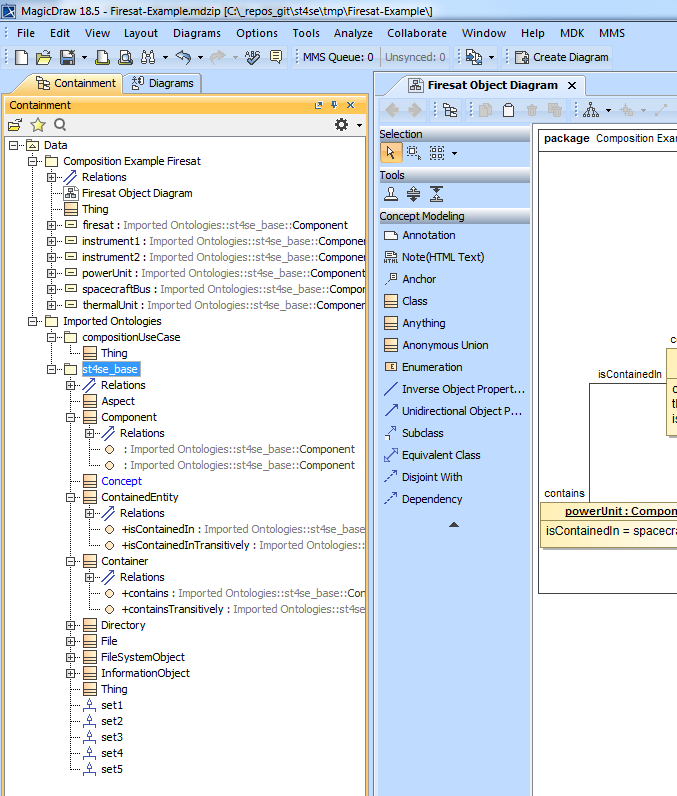

Trial use of Cameo Concept Modeler
==================================

The purpose of this exercise was to investigate whether Cameo Concept Modeler (CCM) is useful for illustrating ontology patterns.

Cameo Concept Modeler is a plugin for ontology modeling in MagicDraw that is described at and available from https://www.nomagic.com/product-addons/magicdraw-addons/cameo-concept-modeler-plugin#intro .

After a little tweaking it was possible to import the OWL ontologies `base.owl` and `compositeUseCase.owl` into CCM. However, only TBox entities came through, not the ABox individuals.

In order to complete the initial investigation, the 6 individuals were created manually in CCM in the form of UML Instance Specifications, which were then linked manually with the `contains / isContainedIn` ObjectProperty. This worked well and the result can be seen in the Object Diagram below.

The screenshot below shows the ontology as loaded into Cameo Concept Modeler.

Conclusion
----------

The basics work, but OWL individuals are not imported. The UML Object Diagram notation should appeal to system engineers familiar with SysML as it uses similar graphical notation. However in its current state the workflow is too cumbersome due to loss of information on import of the OWL ontology files, in particular the OWL individuals. In addition unspecified cardinality on the range of an ObjectProperty (in OWL) does not get translated into `[0..*]` in UML but remains unspecified, and then causes a validation error in the UML instance specifications that has to be corrected manually. 
